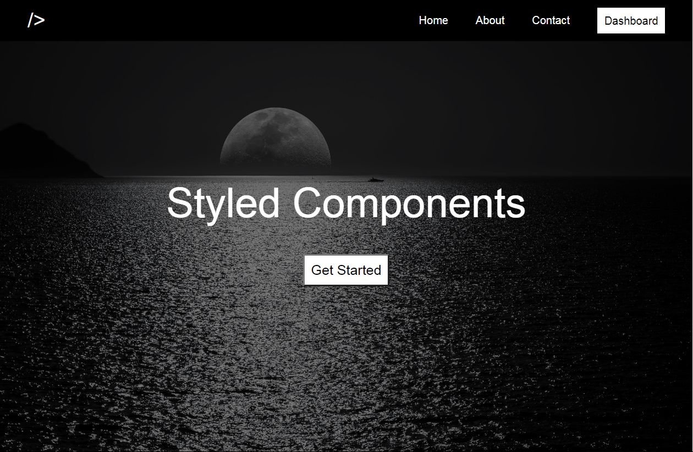

# Site com Styled Components e Rotas em ReactJS

Este é um simples e pequeno site desenvolvido apenas com o propósito de praticar os conceitos da biblioteca Styled Components e entender sobre as Rotas no ReactJS.

## Tecnologias Utilizadas

- [ReactJS](https://pt-br.reactjs.org/)
- [Styled Components](https://styled-components.com/) 

## Como rodar na minha máquina?

Este é apenas um projeto para prática e estudo, se você quiser praticar e estudar também basta seguir os passos abaixo, para rodar o projeto na sua máquina:

- 1º - Certifique se que você tenha instalado o NodeJS e o Git na sua máquina, se você não tiver, sem problemas, baixe-os [aqui](#Links)

- 2º - Clone o projeto deste repositorio para a sua máquina local:
  ~~~shell
  git clone https://github.com/DaniloLima122/styled-components-site.git 
  ~~~
- 3º - Navegue até a pasta que você do diretorio que vocÊ acabou de clonar e instale as dependencias, digitando no seu terminal:

  ~~~shell
  npm install
  ~~~

- 4º-  E por último é só abrir o projeto no seu editori de preferência, e para ver ele rodando é só acessar a pasta do projeto digitar no seu terminal:

  ~~~shell
  npm start
  ~~~

## Contribuição

Este é um projeto apenas para fins de estudo e prática, mas fique a vontade para explorar o projeto e implementar suas próprias idéias e críticas!

## Links

Link para instalação do Git e/ou do Node caso você não tenha na sua máquina:

- [Node.js](https://nodejs.org/en/download/)
- [Git](https://git-scm.com/downloads)
